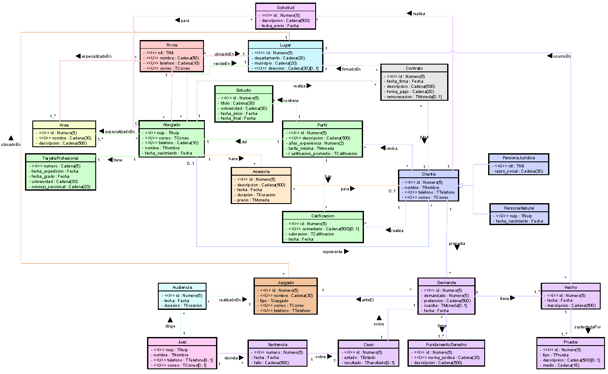

# Proyecto de Modelos y Bases de Datos

Este proyecto se realizó como parte del curso de Modelos y Bases de Datos. Este proyecto consiste en el diseño e implementación de una base de datos relacional para una organización que ofrece servicios jurídicos a personas y empresas. El objetivo es facilitar la conexión entre abogados, clientes, firmas, jueces y juzgados, así como gestionar la información de las demandas, asesorías, contratos y audiencias. Para más información del proyecto abra el archivo "Definición del proyecto.pdf".

## Contenido del Proyecto

El proyecto incluye los siguientes componentes:

- **SQL**: Scripts para crear y manipular la base de datos.
- **CSV**: Archivos CSV que sirvieron como guía para poblar la base de datos.
- **Astah**: Diagramas correspondientes al diseño de la base de datos.

## Diagramas

Algunos de los diagramas realizados (Los diagramas completos están en la carpeta ASTAH) para este proyecto incluyen:

- Diseño Conceptual

  

- Diseño Lógico 

  

- Diseño Físico (Ciclo uno)

  - Componentes

    

  - Datos

     
  
  - Seguridad

    

## Cómo Usar

Para utilizar este proyecto, primero instale la base de datos utilizando los scripts SQL proporcionados. Consulte los diagramas en el archivo Astah para obtener una visión general de la estructura del proyecto.

Orden de creación de la base de datos:

1. Tablas.sql
2. Atributos-Tuplas.sql
3. Primarias.sql
4. Unicas.sql
5. Foraneas.sql
6. Acciones.sql
7. Disparadores.sql 
8. ActoresE.sql
9. ActoresI.sql
10. CRUDE.sql
11. CRUDI.sql
12. Indices.sql 
13. Vistas.sql
14. Seguridad.sql
15. PoblarOk.sql

Pruebas de la base de datos:

- No deben fallar
1. AccionesOk.sql
2. CRUDOK.sql
3. DisparadoresOK.sql
4. IndicesVistasOK.sql
5. SeguridadOk.sql
- Deben fallar:
6.  CRUDNoOk.sql
7. DisparadoresNoOK.sql
8. PoblarNoOK.sql
- Ejemplo de consulta
9.  Consultas.sql

Eliminación de la base de datos:

1. XPoblar.sql
2. XSeguridad.sql
3. XIndicesVistas.sql
4. XCRUD.sql
5. XDisparadores.sql
6. XTablas.sql
